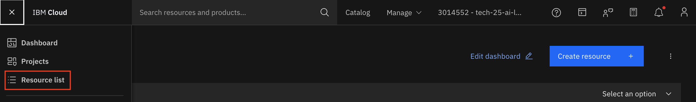
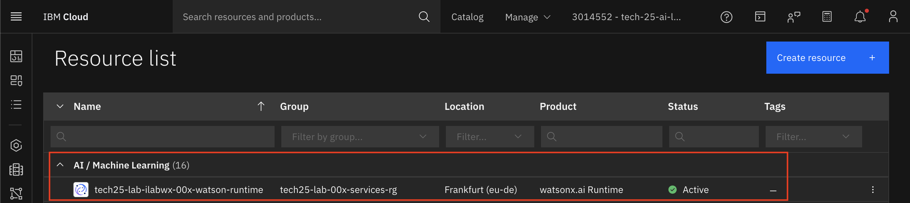
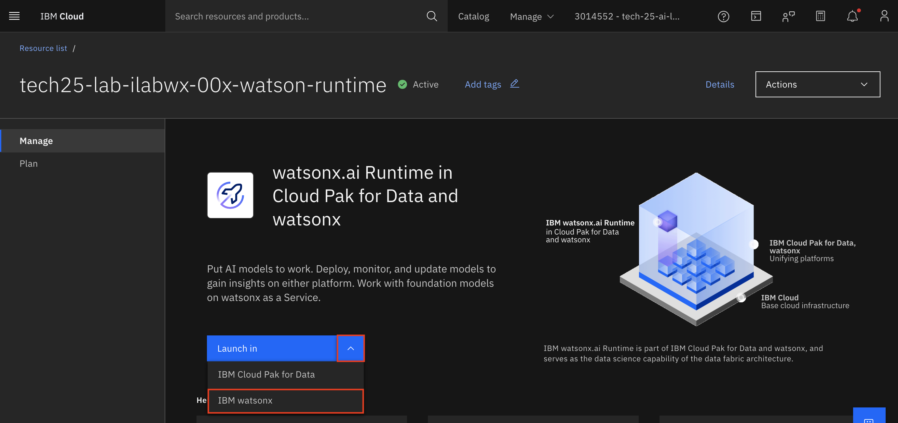
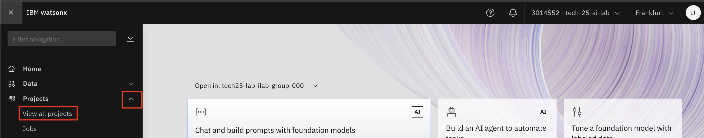
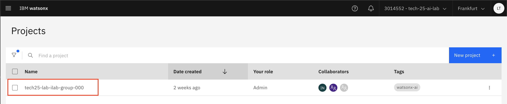
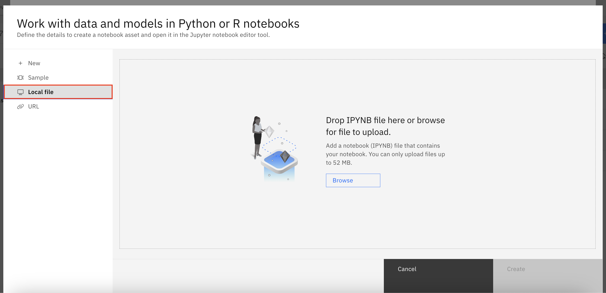
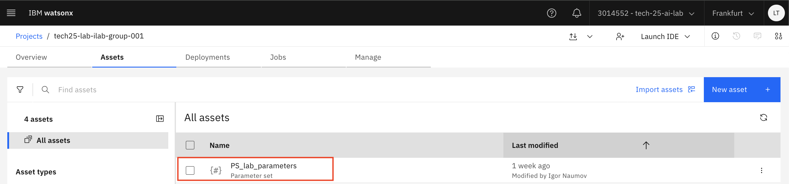
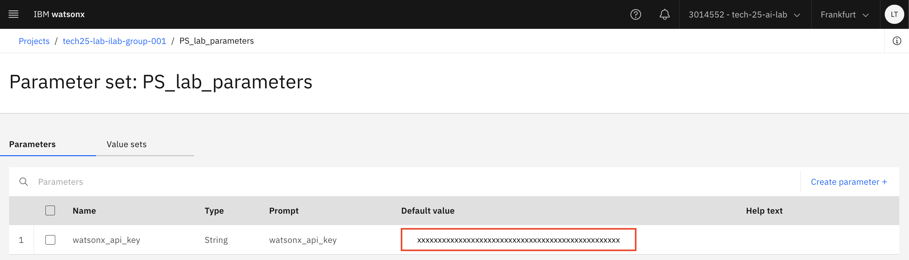

# Lab Part A: Prepare Notebook and Notebook Overview

In this section, we will begin by uploading the Python notebook and preparing it for execution, which includes adding an API key to the notebook. Afterwards, we will walk through the notebook's environment and demonstrate how to run the notebook effectively. 
_________

#### Navigate to Project and Upload Notebook

1. On the IBM Cloud Console, open the Navigation menu to the right, select **Resource list**

    

2. Click the dropdown menu for **AI / Machine Learning**
3. Select the runtime instance, **tech25-lab-ilabwx-00x-watson-runtime** where 00x is your group number.

    

4. Select the down arrow next to **Launch in** and select **IBM watsonx**

    

5. Open the Navigation menu to the right, and select **View all projects**

    

6. Find your project and select it 

    

7. Download the notebook
    * Go to this [Github Link](https://github.com/IBM/industry-solns-tech2025-ai-lab/blob/main/jupyter-notebook/NB-ai-agent-loan-risk-tech2025-lab-a.ipynb)
    * You should now see a preview of the notebook on Github
    * Select the triple dot on the upper right hand corner
    * Select **Download**
8. Upload the notebook  
    * Select **New asset** in the upper right-hand corner.  

    

    * Search for **notebook** and select **Work with data models in Python or R notebooks**  

    

    * Select **Local file**  

    

    * Upload the notebook you downloaded from Github. 

#### Retrieve the API Key for the Notebook

1. At your project level under the asset list, you will see an **Parameter set** named **UPDATE WITH NAME**

    

2. Open the parameter set in a new window. Keep this window open until you have added the API key to the notebook. To open in a new window:
    * On Mac: hold down the Command (⌘) key + click the parameter set name.
    * On Windows: Ctrl + click the parameter set name.
3. Copy the API key value under the **Default value** column. You will be pasting it in the next couple of steps. 
    * Highlight the keys value
        * On Mac: **Command (⌘) key + C** to copy the key
        * On Windows **Ctrl + C** to copy the key

    

#### Helpful Tips for Running a Jupyter Notebook

1. **Running Cells**:  
- To execute a cell, click on the cell and press **Shift + Enter** (or just click the "Run" button in the toolbar).
- Make sure to run all cells in order from top to bottom to ensure that variables and functions are properly defined in the right sequence.
- When a cell is running it will have an asterisk [*] next to it, indicating it is still running. When completed  bracketed number will appear to the right of the cell indicating the order in which the cells have been executed. For example: [1]

2. **Kernel**:  
- If you encounter errors or if a cell isn’t executing, the kernel (the engine that runs your code) might have stopped or encountered an issue. You can restart the kernel by selecting **Kernel** > **Restart** from the menu. This will clear all variables and reset the environment.

3. **Markdown Cells**:  
- Markdown cells (those not containing code) are used for explanations, comments, or instructions.