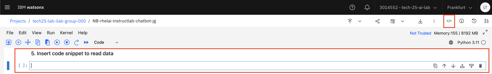

# Notebook Walkthrough Exercise 1

In this section, we will work through exercise 1A and 1B.

First, in Exercise 1A, you'll interact with a granite-3.1-8b-base model that's been set up on a Red Hat Enterprise Linux (RHEL) AI VSI. This provides a stable and secure environment for exploring the capabilities of the LLM. Next, you'll learn how to use external assets to summarize documents, Exercise 1B. 

-----

## Exercise 1A

**Cell 1: Install prerequisite libraries (requests, json, getpass)**

**No action required**.

**Explanation**:  
In this cell, we install the necessary Python packages required to interact with the model server. These 
libraries include `requests` for making HTTP requests, `json` for parsing JSON data, and `getpass` for 
securely handling passwords or API keys.

-----

**Cell 2: Set the variables for accessing the model server**

**No action required**.

**Explanation**:  
In this cell, we define the model server URL and any necessary authentication credentials. This step is crucial for 
establishing a connection with the model server.

-----

**Cell 3: Define function to chat with model using request package**

**No action required**.

**Explanation**:  
This cell defines a Python function that uses the `requests` library to send a POST request to the model 
server, initiating a conversation with the AI agent. The function takes in a prompt as input and returns the 
response from the model.

-----

**Cell 4: Provide a prompt to chat with the served model**

**Action required**: Type a question or statement when prompted, and press Enter to initiate the 
conversation. To exit the chat loop, type `exit` or `quit`.  

**Explanation**:  
In this cell, we test the AI's functionality by interacting with it using natural language questions or 
statements. The model will process our input and respond accordingly.

## Exercise 1B

**Cell 5: Insert code snippet to read data**

**Action required**: Follow the below steps to insert a code snippet to read data. 

**Explanation**:  
This cell reads in some sample data from a file stored in IBM Cloud Object Storage. This data is used as an 
external asset for the document summarization use case later on.

**Steps to Insert code snippet to read data**

1. Download a file from this [Github folder](https://github.com/IBM/industry-solns-tech2025-ai-lab/tree/main/datasets/SpringNature/samples). It is recommended to open the link in a new tab.
    - Select one asset to download from the folder.
    - Select the triple dot to download the asset.

    

    - Navigate back to the notebook.

2. Click on **Upload asset to project**

    

3. Upload the file you downloaded from GitHub

4. Make sure the cell under step 5 is selected. Click on **Code Snippets**

    

5. Click on **Read data**

    

6. Click on **Select data from project**

    

7. Select **data asset** and click on the file you uploaded. Click **Select**

    

8. Make sure **Load as** as **StreamingBody object** selected and click **Insert code to cell**.

    

9. The code should now be inserted into the cell. Click the **x** to close the window.

    

-----

**Cell 6: Review the document contents**

**No action required**.

**Explanation**:  
In this cell, we review the contents of the document that was just read in from the file.

-----

**Cell 7: Chat with the documents**

**Action required**: Review the document's content and ask the AI agent questions about it.  

**Explanation**:  
This cell allows us to interact with the AI using the external asset (document) we just reviewed. We can ask 
questions, get summaries, or even use the document as input for other tasks.

-----

Proceed to the next section for Exercise 2 and 3 of Lab B.
