# Lab Part B: Prepare Notebook and Notebook Overview

In this section, we will begin by uploading the Python notebook and preparing it for execution. Afterwards, we will walk through the notebook's environment and demonstrate how to run the notebook effectively. 
_________

#### Navigate to Project and Upload Notebook

1. On the IBM Cloud Console, open the Navigation menu to the right, select **Resource list**

    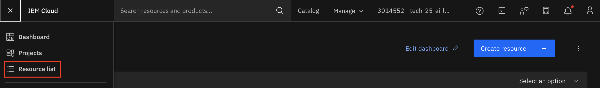

2. Click the dropdown menu for **AI / Machine Learning**
3. Select the runtime instance, **tech25-lab-ilabwx-00x-watson-runtime** where 00x is your group number.

    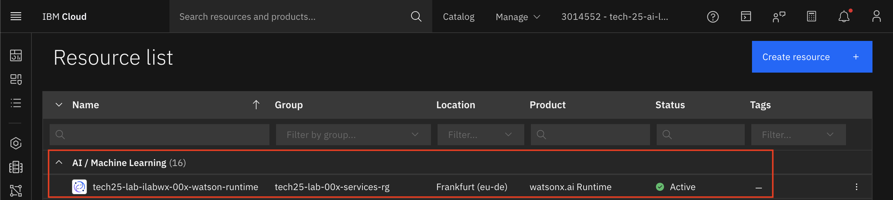

4. Select the down arrow next to **Launch in** and select **IBM watsonx**

    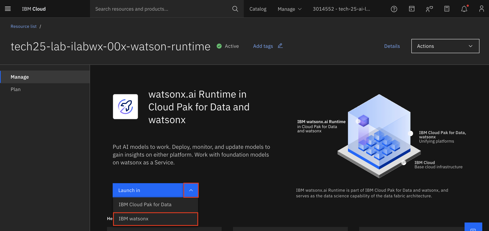

5. Open the Navigation menu to the right, and select **View all projects**

    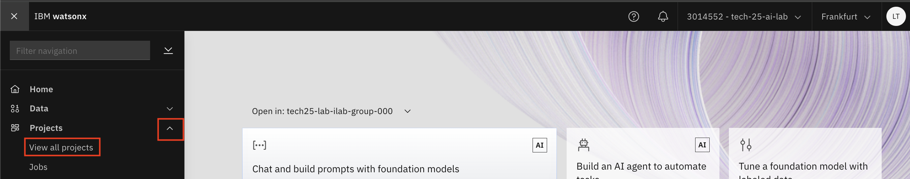

6. Find your project and select it 

    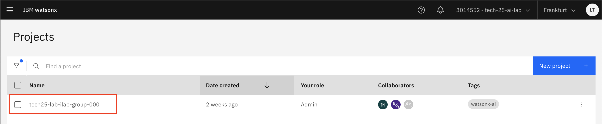

7. Download the notebook
    * Go to this [Github Link](https://github.com/IBM/industry-solns-tech2025-ai-lab/blob/main/jupyter-notebook/NB-rhelai-instructlab-chatbot.ipynb), it is recommended to open in a new tab.  
        - On Mac to open a new tab: hold down the **Command (⌘) key + click the link**.  
        - On Windows to open a new tab: **Ctrl + click the link**.
    * You should now see a preview of the notebook on Github
    * Select the triple dot on the upper right hand corner

    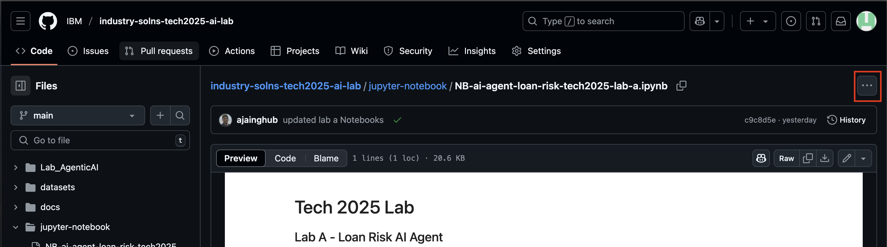

    * Select **Download**

    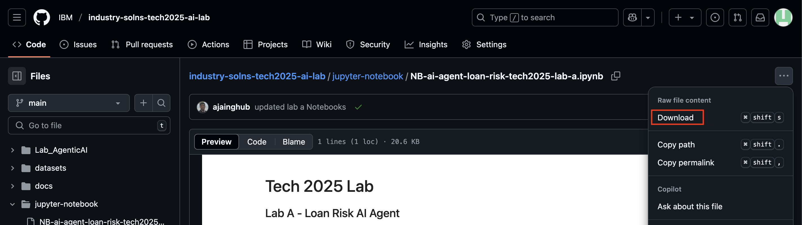

8. Upload the notebook  
    * Select **New asset** in the upper right-hand corner.  

    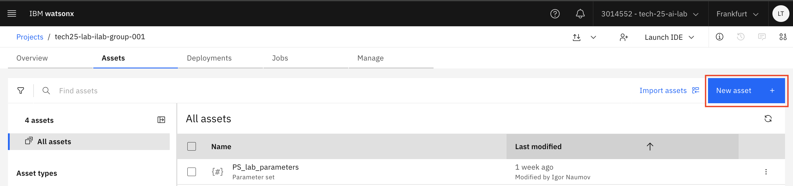

    * Search for **notebook** and select **Work with data models in Python or R notebooks**  

    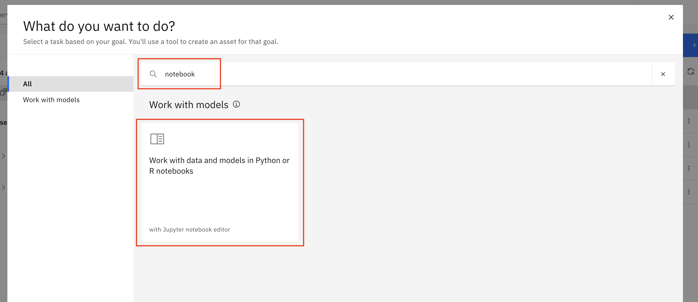

    * Select **Local file**  

    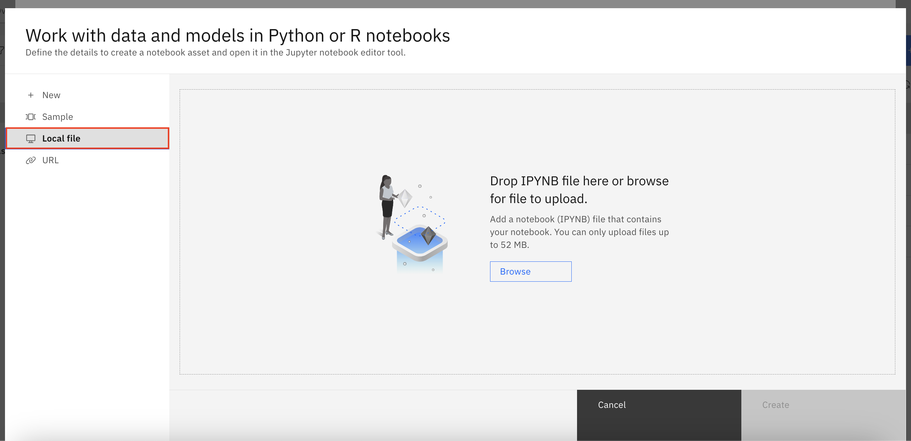

    * Upload the notebook you downloaded from Github. 

9. Select the notebook you just uploaded to open. 

10. Select the pencil in the upper-right hand corner of the notebook to open in edit mode. This is so you can execute the notebook.

    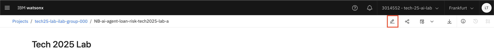

11. To execute a cell, click the "Run" button in the toolbar.
    - Make sure to run all cells in order from top to bottom to ensure that variables and functions are properly defined in the right sequence.
    - When a cell is running it will have an asterisk [*] next to it, indicating it is still running. When completed bracketed number will appear to the right of the cell indicating the order in which the cells have been executed. For example: [1]

    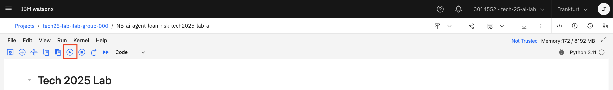

#### Helpful Tips for Running a Jupyter Notebook

1. **Kernel**:  
- If you encounter errors or if a cell isn’t executing, the kernel (the engine that runs your code) might have stopped or encountered an issue. You can restart the kernel by selecting **Kernel** > **Restart Kernel** from the menu. This will clear all variables and reset the environment.

2. **Markdown Cells**:  
- Markdown cells (those not containing code) are used for explanations, comments, or instructions.